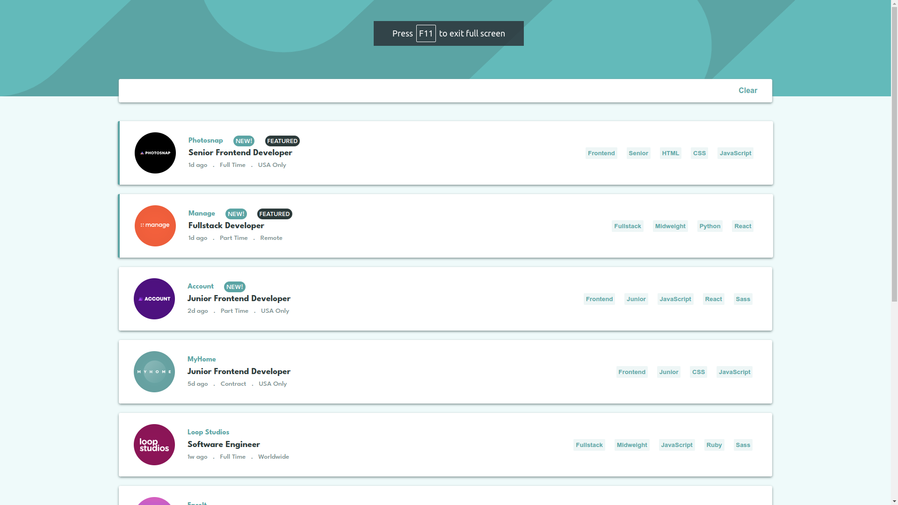
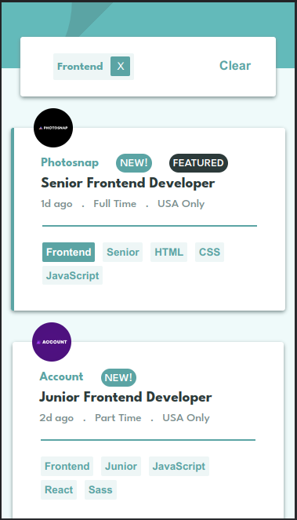

# Frontend Mentor - Job listings with filtering solution

This is a solution to the [Job listings with filtering challenge on Frontend Mentor](https://www.frontendmentor.io/challenges/job-listings-with-filtering-ivstIPCt). Frontend Mentor challenges help you improve your coding skills by building realistic projects. 

## Table of contents

- [Overview](#overview)
  - [The challenge](#the-challenge)
  - [Links](#links)
  - [Screenshot](#screenshot)
- [My process](#my-process)
  - [Built with](#built-with)
  - [What I learned](#what-i-learned)
  - [Continued development](#continued-development)
  - [Useful resources](#useful-resources)
- [Author](#author)

## Overview

### The challenge

Users should be able to:

- View the optimal layout for the site depending on their device's screen size
- See hover states for all interactive elements on the page
- Filter job listings based on the categories

### Links

- Solution URL: [GitHub Repo](https://github.com/keshavkumarhembram/fm-static-job-listings-master)
- Live Site URL: [Live Site](https://keshavkumarhembram.github.io/fm-static-job-listings-master/)

### Screenshot

## My process

### Built with

- CSS custom properties
- Flexbox
- CSS modules
- [React](https://reactjs.org/) - JS library

### What I learned

- Correctly put dependencies in useEffect otherwise it can be stuck in infinite loop.

### Continued development

- For this project I have only used useState and useEffect Hook there are many hooks left to try on project.

### Useful resources
- [How to deploy react app?](https://blog.logrocket.com/8-ways-deploy-react-app-free/): this article helped me deploy react app correctly.

## Author

- Github - [keshavkumarhembram](https://github.com/keshavkumarhembram)
- Frontend Mentor - [@keshavkumarhembram](https://www.frontendmentor.io/profile/keshavkumarhembram)
- Twitter - [@keshavhembram](https://twitter.com/keshavhembram)

